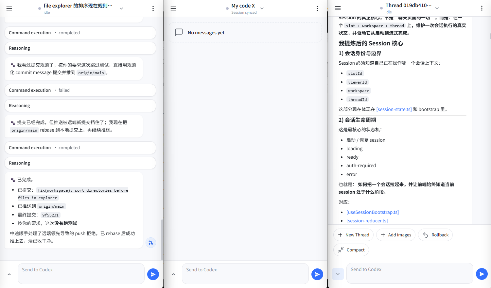
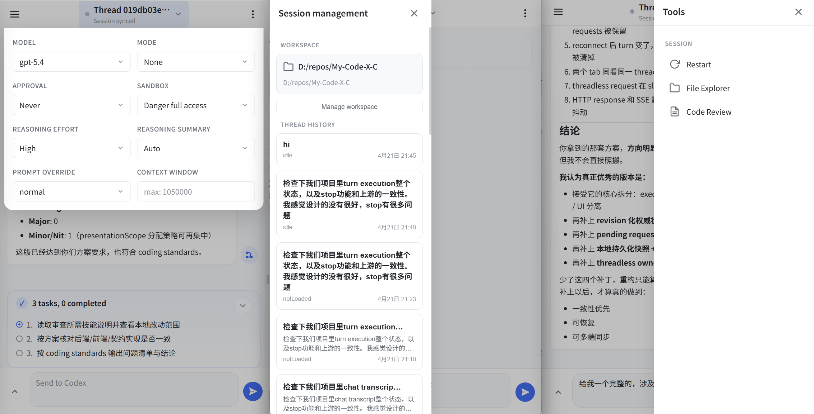

简体中文 | [English](./README.md)

# My-Code-X

用手机浏览器调度本地Codex，可用于vibe-coding或其他生产工作。

My-Code-X 让你可以从手机、平板或电脑浏览器中使用 Codex，支持多页签多目录同时对话。

跨平台可用：windows, linux, macOS

## 功能

- local-first，My-Code-X完全不搜集你的任何数据
- 默认通过 Tailscale 连接服务，便于安全快捷地远程访问
- 支持覆盖 Codex 基础prompt，从而便于prompt设计或非vibe-coding的其他工作
- 支持上下文窗口设置
- 支持图片上传
- 支持快速浏览本地workspace的文件并编辑

## 功能示意

### 多页签同时工作


### 支持不同功能


## 依赖要求

开始前请先准备：

- 安装 Codex 的 CLI 或 Windows 应用
- 在手机和电脑上安装 Tailscale

## 快速开始

直接下载对应平台的最新便携包：

- [Windows x64](https://github.com/djwang126/My-Code-X/releases/latest/download/my-code-x-windows-x64.zip)
- [Linux x64](https://github.com/djwang126/My-Code-X/releases/latest/download/my-code-x-linux-x64.tar.gz)
- [macOS arm64](https://github.com/djwang126/My-Code-X/releases/latest/download/my-code-x-macos-arm64.tar.gz)

便携包解压后可直接使用：

- Windows 启动：`start-my-code-x.cmd`
- Windows 停止：`stop-my-code-x.cmd`
- Linux / macOS 启动：`start-my-code-x.sh`
- Linux / macOS 停止：`stop-my-code-x.sh`

## 配置说明

### env 配置

My-Code-X 会优先从用户目录读取配置：

- Windows 默认目录：`%USERPROFILE%\.My-Code-X\`
- Linux / macOS 默认目录：`~/.My-Code-X/`

常用配置项：

| 变量名 | 默认值 | 说明 |
| --- | --- | --- |
| `PORT` | `4310` | Web 服务端口 |
| `MY_CODE_X_CODEX_IDLE_SHUTDOWN_MINUTES` | `10` | Codex 空闲自动关闭时间（分钟） |

示例：

```env
PORT=4310
MY_CODE_X_CODEX_IDLE_SHUTDOWN_MINUTES=10
```

### 自定义 Prompt 覆盖

My-Code-X 的 Prompt override 来自 `.My-Code-X/custom-harness/prompts-override` 目录中的 Markdown 文件，可以进行任意修改或新增。

文件内容就是你希望注入给 Codex 的基础prompt。文件名会直接显示为设置面板里的 Prompt override 选项，例如 `reviewer.md` 会显示为 `reviewer`。

需要重启 My-Code-X 才会重新加载选项。

## 安全说明

- LAN 模式可能会把应用暴露给你本地网络中的其他设备
- Tailscale 通常是更安全的远程访问方式
- Cloudflare Quick Tunnels 目前不推荐使用，并且它不支持 SSE

## 已知问题

目前主要是 Windows 上运行与测试，Linux或者MacOS可能会有问题，请开issue。
Codex原生的Code Review功能表现会比较奇怪，不建议使用

## 许可证

本项目使用 GNU Affero General Public License v3.0 only（`AGPL-3.0-only`）。完整内容见 [LICENSE](LICENSE)。

如果你修改了 My-Code-X，并通过网络让用户访问这个修改后的版本，那么 AGPL 要求你向这些用户提供他们正在使用版本所对应的源代码。

本仓库的公开主仓库地址为：

- <https://github.com/djwang126/My-Code-X>
